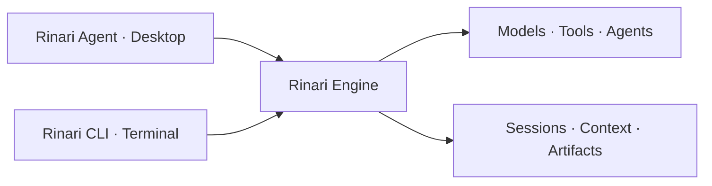

<div align="center">


# Rinari Agent

**Turn a conversation into work you can inspect.**

A desktop workspace for AI-assisted development, research and project work.
Bring your models. Keep your context. Follow the execution.

[](https://github.com/Xainner/Rinari-Agent/actions/workflows/agent-ci.yml)


[Get started](#get-started) · [Explore the workspace](#a-workspace-that-keeps-you-in-the-loop) · [Build from source](#build-from-source) · [Report an issue](https://github.com/Xainner/Rinari-Agent/issues)

</div>

## Your task is more than a prompt

Real work involves files, decisions, commands, revisions and a reason to trust the result. Rinari Agent brings those pieces together around the conversation, so you can ask for a change, follow the work and inspect what happened without piecing it together from terminal output.

It is the desktop home for [Rinari Engine](https://github.com/Xainner/Rinari-CLI): the same engine behind Rinari CLI, with a visual workspace for projects, tools, agents and results.

> **Available in the current source, evolving toward v1.** This README describes the implemented desktop experience, not a promise that every feature is included in an older installer. Check the [release notes](https://github.com/Xainner/Rinari-Agent/releases) for the build you install. Features also depend on a compatible engine and the capabilities of your selected model.

## A workspace that keeps you in the loop

### Start with intent. Stay with the project.

Open a folder, start a chat or pick up a saved session. Organize projects, pin the ones you use, and resume conversations with their history intact. Choose **PLAN**, **BUILD** or **REVIEW** to express how you want to approach the task; the engine applies the corresponding execution and permission rules.

Attach source files, images, PDFs, Word documents or spreadsheets. Use `@` search to bring workspace files into the conversation. Document extraction, OCR and supported vision inputs help turn existing material into useful context—not just another file path in a prompt.

### See the work behind the answer.

Follow model messages, tool calls, command output and results in an execution timeline. Inspect elapsed time, errors and cancellation state. When agents are involved, expand their activity to see their objective, commands, permissions and result alongside the parent conversation.

When a decision needs your input, answer an interactive question or respond to an approval request in context. Observable activity is shown as activity—not presented as private model reasoning.

### Review what changed, not just what was said.

Inspect project changes and diffs, task state, verification results, artifacts, context and usage from the workspace. Preview checkpoint restoration before confirming it. Where supported by the engine, review and undo changes associated with a turn.

Rinari gives you the evidence to review a result. A generated answer is not a substitute for tests, and a successful tool call is not a guarantee that a task is correct.

### Keep execution within reach.

The browser panel shows captures of the page the engine is actually using. Choose a page, minimize the panel or open it externally for manual interaction. It is an observation view of the engine browser, not a second browser pretending to share its state.

The processes panel shows session-owned background commands, logs and status, with controls to stop managed resources. Local HTML previews have their own viewing surface. Follow a development server or inspect its output without losing the conversation.

## Your models. Your working style.

| Make it yours | What is available today |
| :--- | :--- |
| **Provider connections** | Setup presets for OpenAI, Anthropic, Ollama, LM Studio and custom compatible endpoints. Test connections and discover models. |
| **Model selection** | Choose models and supported reasoning effort for conversations; configure agent model assignments. |
| **Context and tools** | Work with file attachments, workspace search, engine tools, MCP connections and plugins. |
| **Rinari's voice** | Choose and manage Souls separately from tool permissions and execution policy. |
| **Desktop comfort** | English and Spanish, appearance settings, keyboard shortcuts, command palette and reduced-motion preferences. |

You supply the provider connection. Remote providers may charge for usage; local models require a running compatible server and suitable hardware. Tool calling, vision and reasoning options vary by model.

## A few ways to put Rinari to work

These are starting prompts, not pre-recorded outcomes. Results depend on your project, model, available tools and permissions.

| Start with… | Then use the workspace to… |
| :--- | :--- |
| “Map this repository and propose a plan before editing.” | Read the plan, inspect the files consulted and decide how to proceed. |
| “Implement this change and run the relevant tests.” | Follow commands, answer approvals and review the resulting diff and verification. |
| “Review these changes for regressions.” | Inspect findings against the actual changed files. |
| “Use this PDF and these screenshots to explain the requirements.” | Supply document and visual context, subject to extraction and model capabilities. |
| “Investigate this page and summarize what you find.” | Observe the engine browser and inspect the supporting tool results. |

## Get started

1. **Choose a build.** Visit [Releases](https://github.com/Xainner/Rinari-Agent/releases) and read its platform and installation notes. If no suitable build is published, [build from source](#build-from-source).
2. **Connect a model.** Configure a provider in Settings, test the connection and select a model appropriate for your task.
3. **Bring your work.** Open a project or create a conversation. Add the files Rinari needs, choose a mode and describe the outcome you want.
4. **Stay involved.** Follow activity, respond to approvals and review the results before relying on them.

With an updated Rinari CLI and the desktop executable available:

```bash
rinari desktop .
```

`rinari code` remains a compatibility alias. Set `RINARI_AGENT_BIN` to the desktop executable if it is not on `PATH`. The separate `rinari agent` command retains its autonomous-task meaning.

Upgrading from Rinari Code? Read the [identity and profile migration notes](docs/identity-migration.md).

## Know the boundaries

- **A desktop agent workspace, not a full IDE replacement.** A full terminal workspace, advanced Soul editing and an enriched Agent Studio remain outside the current offering.
- **Local desktop does not mean every task stays offline.** Cloud models and external tools can send data to their configured services. Credentials are owned by the engine, not stored in frontend browser storage.
- **Capabilities are explicit.** Attachments have size and page limits; OCR and vision have distinct requirements. See [attachments, OCR and vision](docs/attachments.md).
- **Process ownership matters.** The processes panel manages engine-owned session resources, not arbitrary operating-system processes, and does not promise recovery of running processes after an engine crash.
- **Distribution is still maturing.** Windows NSIS/MSI packaging is implemented. Signed updates, upgrade paths and other platforms need release-specific validation; do not infer platform readiness from the use of Tauri alone.

## One engine. Two ways to work.

The desktop does not duplicate the agent runtime. Rinari Engine owns execution, sessions, model routing, approvals, credentials and persistent operational state. Rinari Agent makes that state visible and provides native desktop integration.



The desktop uses **React 19 + TypeScript** for the interface and **Rust + Tauri 2** for the native host. A versioned protocol over stdio connects it to the Python engine. The compatible revision and required capabilities are pinned in [engine-manifest.json](engine-manifest.json).

## Build from source

You will need Node.js compatible with the Vite toolchain, npm, Rust stable, your platform's Tauri build dependencies, and a compatible [Rinari CLI checkout](https://github.com/Xainner/Rinari-CLI). Running the engine from source also requires Python 3.11+ and uv. Windows requires WebView2.

```bash
git clone https://github.com/Xainner/Rinari-Agent.git
cd Rinari-Agent
npm ci
```

Point the native host at your engine checkout, using the revision in the manifest. PowerShell example:

```powershell
$env:RINARI_ENGINE_BIN = "uv"
$env:RINARI_ENGINE_ARGS = "run rinari"
$env:RINARI_ENGINE_CWD = "C:\dev\Rinari-CLI"
npm run tauri dev
```

Replace the checkout path with your own. The host also supports configured installations and packaged engine resources. A Vite-only preview is not a substitute for the native host and engine.

<details>
<summary><strong>Validation and Windows packaging</strong></summary>

```bash
npm test
npm run protocol:check
npm run build
cargo fmt --manifest-path src-tauri/Cargo.toml --check
cargo clippy --manifest-path src-tauri/Cargo.toml --all-targets -- -D warnings
cargo test --manifest-path src-tauri/Cargo.toml
```

Protocol checks require the matching engine schema. When changing the contract, update the engine first, regenerate the desktop types and validate both repositories.

```powershell
powershell -ExecutionPolicy Bypass -File scripts/package-engine.ps1 -CliRepo C:\dev\Rinari-CLI
npm run tauri build
```

The packaging script builds the engine bundle; Tauri produces the installer. See the [packaging decision](docs/adr/0001-engine-packaging.md) and [release guide](docs/releases.md) for distribution and signing requirements.

</details>

## Go deeper

[Architecture and contributor rules](AGENTS.md) · [Activity timeline](docs/activity-timeline.md) · [Agents and browser](docs/agents-and-browser.md) · [Background processes](docs/background-processes.md) · [Attachments](docs/attachments.md) · [Release guide](docs/releases.md)

Found a bug or a workflow that needs attention? [Open an issue](https://github.com/Xainner/Rinari-Agent/issues) with your app and engine versions, reproduction steps and redacted logs. Never include provider keys or private project data.

---

<div align="center">


**Bring the idea. Keep sight of the work.**

[Explore releases](https://github.com/Xainner/Rinari-Agent/releases) · [Meet the engine](https://github.com/Xainner/Rinari-CLI) · [Help shape Rinari](https://github.com/Xainner/Rinari-Agent/issues)

<sub>Rinari character illustrations are brand artwork, not application screenshots.</sub>

</div>
