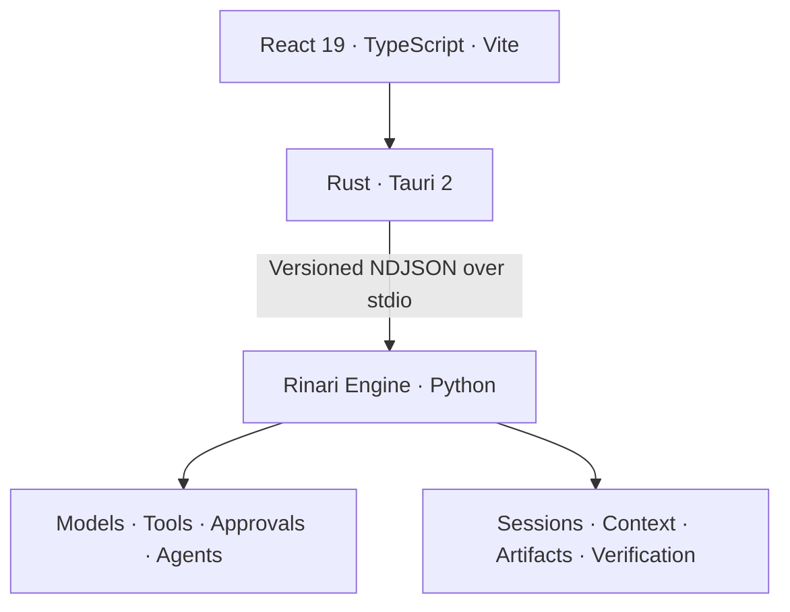

<div align="center">


# Rinari Code

**The desktop workspace for the Rinari agent harness.**

Conversations · Execution activity · Projects · Verification

[](https://github.com/Xainner/Rinari-Code/actions/workflows/code-ci.yml)


[Get started](#get-started) · [Workspace](#workspace) · [Architecture](#architecture) · [Development](#development) · [Engine](https://github.com/Xainner/Rinari-CLI)

</div>

---

Rinari Code brings conversations, tool activity and project state into a native desktop interface. Follow execution as it happens, respond to approvals, inspect changes and continue work across persistent sessions.

**The harness lives in [Rinari Engine](https://github.com/Xainner/Rinari-CLI).** This repository supplies its desktop client: a React interface, a Rust host and native integration through Tauri.

> **Status:** Active development toward stable v1. Check [Releases](https://github.com/Xainner/Rinari-Code/releases) for published builds. Source code may include work beyond the latest release.

## Get started

1. Check the available builds and release notes in [Releases](https://github.com/Xainner/Rinari-Code/releases).
2. Launch Rinari Code and configure a provider and model.
3. Open a project or start a conversation, choose a mode and send a task.

With Rinari CLI and the desktop client installed:

```bash
rinari code .
```

For a source build, follow [Development](#development).

## Workspace

| Surface | What you can do |
| :--- | :--- |
| **Conversations** | Stream responses, resume persisted sessions and organize work by project. |
| **Execution activity** | Inspect model and tool calls, results, elapsed time, failures and cancellation state. |
| **Modes and access** | Select PLAN, BUILD or REVIEW and use engine-enforced permission profiles. |
| **Providers and models** | Configure connections, discover models and choose per-chat models and reasoning effort. |
| **Project context** | Attach files and use `@` search to include workspace text and code. |
| **Inspection** | Review changes, tasks, verification, checkpoints, artifacts, context and usage. |
| **Configuration** | Manage agents, Souls, MCP, plugins, policies, profiles and appearance. |
| **Desktop integration** | Use native dialogs, engine supervision, restart recovery and command-palette navigation. |

The interface supports English and Spanish, themes, keyboard navigation and reduced-motion preferences. Activity reports observable execution events and results.

## Architecture



| Layer | Responsibility |
| :--- | :--- |
| **React** | Conversation rendering, activity views, settings and local layout state. |
| **Rust / Tauri** | Engine lifecycle, protocol transport, native dialogs and OS integration. |
| **Rinari Engine** | Agent execution, sessions, model routing, permissions, credentials and durable state. |

The host supervises a long-lived engine process. A negotiated protocol exposes requests and events, while `runtime.snapshot.get` reconstructs the UI after reconnects. Provider credentials remain engine-owned.

The compatible engine revision is pinned in [engine-manifest.json](engine-manifest.json). Generated TypeScript and Rust types keep the desktop bridge aligned with the engine schema.

File preparation, PDF page selection, OCR and model vision admission are
documented in [Attachments, OCR and vision](docs/attachments.md).

## Development

### Prerequisites

- Node.js compatible with the Vite toolchain and npm.
- Rust stable and native Tauri build dependencies for your platform.
- Python 3.11+ and uv when running the engine from source.
- A compatible [Rinari CLI](https://github.com/Xainner/Rinari-CLI) checkout.
- Windows WebView2 for Windows development.

```bash
git clone https://github.com/Xainner/Rinari-Code.git
cd Rinari-Code
npm ci
```

Point the desktop host at your engine checkout. Example for PowerShell:

```powershell
$env:RINARI_ENGINE_BIN = "uv"
$env:RINARI_ENGINE_ARGS = "run rinari"
$env:RINARI_ENGINE_CWD = "C:\dev\Rinari-CLI"
npm run tauri dev
```

Replace the path with your checkout location. The host also supports configured installations and packaged engine resources.

### Validate

```bash
npm test
npm run protocol:check
npm run build
cargo fmt --manifest-path src-tauri/Cargo.toml --check
cargo clippy --manifest-path src-tauri/Cargo.toml --all-targets -- -D warnings
cargo test --manifest-path src-tauri/Cargo.toml
```

Protocol checks require the schema matching the engine revision in the manifest. When changing the shared contract, update the engine first, regenerate desktop types and validate both repositories.

### Package for Windows

```powershell
powershell -ExecutionPolicy Bypass -File scripts/package-engine.ps1 -CliRepo C:\dev\Rinari-CLI
npm run tauri build
```

The packaging step builds the engine bundle; Tauri then produces the installer. See the [packaging decision](docs/adr/0001-engine-packaging.md) and [release guide](docs/releases.md).

## Documentation

| Guide | Contents |
| :--- | :--- |
| [Implementation blueprint](AGENTS.md) | Architecture, ownership and contributor rules |
| [Activity timeline](docs/activity-timeline.md) | Execution-event presentation |
| [Engine packaging](docs/adr/0001-engine-packaging.md) | Engine distribution and compatibility |
| [Releases](docs/releases.md) | Build and release process |
| [Technical debt](docs/debt.md) | Known limitations and follow-up work |
| [Rinari Engine](https://github.com/Xainner/Rinari-CLI) | Canonical harness and terminal client |

---

<div align="center">

**One engine. Terminal and desktop.**

[Rinari CLI](https://github.com/Xainner/Rinari-CLI) · [Releases](https://github.com/Xainner/Rinari-Code/releases) · [Issues](https://github.com/Xainner/Rinari-Code/issues)

</div>
